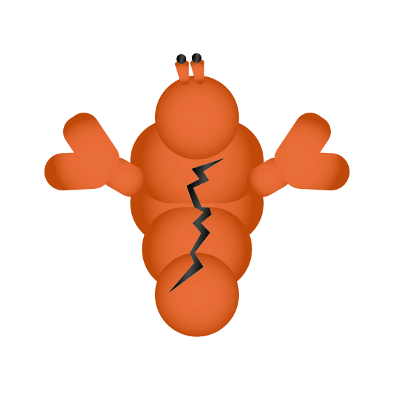

<p align="center">
  
</p>

<h1 align="center">exuvia</h1>

<p align="center">
  <em>A character and aesthetic-first AI assistant.</em><br />
</p>

<p align="center">
  <a href="https://github.com/toprakfirat/Exuvia/releases"></a>
  <a href="./LICENSE"></a>
  <a href="https://docs.openclaw.ai"></a>
</p>

---

This project was originally an end to end AI agent I started to learn about the patterns and how to of building an AI agent. The ultimate goal was to finally achieve a helpful AI assistant that also is not just a chat screen or a boring looking character but an *AURA FARMING CYBER PERSONALITY* that I'd enjoy spending time with. After building the foundations and connecting my agent with different MCPs, I got kinda bored with researching and managing and debugging tool calls so I decided to just use [openclaw](https://docs.openclaw.ai) for backend. I still have the original project in a different private repo but I wanted to share the vibecoded avatar part which just works as a client to your local openclaw's websocket gateway.

In the app, you can create different avatars with custom GLB or FBX files with embedded animations, which is corresponding to separate openclaw sessions, give them persoanlities, modify environme, customize lights and HDRIs and fx to make them look cool and fit in with your computer. You can also connect your avatar with channels to keep talking to them. 

> *Exuviation* — the act of shedding a shell. Your AI doesn't have to wear
> the same suit on every surface; this is the shell it wears.

<p align="center">

https://github.com/user-attachments/assets/e4741346-5626-4f1e-a1dc-7aa116be907e

</p>


---

## What you get

- **Custom 3D avatars.** Drop in a GLB or FBX, the wizard handles scaling,
  animations, lighting, and post-FX. Each avatar has its own personality
  file (`SOUL.md`), its own form of address for you ("boss", "babe", your
  name), and its own per-clip animation catalogue.
- **Cinematic look, fully tunable.** Each avatar has its own scene —
  swap in any HDRI for image-based lighting, drop in a GLB room as the
  set, sculpt the lighting rig (key/fill/rim and as many extra lights as
  you want, each with color, intensity, and position), then layer on
  post-FX: bloom, distance blur, barrel distortion, color grading,
  vignette, film grain. Drag the sliders, watch the scene update live.
- **Voice in, voice out.** Hold Space (or your custom hotkey) to talk;
  the transcript goes straight to the avatar. The avatar replies with
  TTS audio, a word-by-word reveal in chat, and animation cues on
  emotional beats.
- **Lives in your tray.** Closing the window hides to the system tray.
  Bind a global hotkey (Ctrl+Shift+E or whatever you like) to summon the
  avatar from anywhere on your system.
- **Same character across every channel.** Configure once, chat from
  Telegram, WhatsApp, Discord, iMessage — the avatar uses the same voice
  and personality everywhere.
- **Sharing.** Export any avatar as a single `.exuvia` file (mesh +
  personality + animations + post-fx). Drag-and-drop the file onto the
  app to import it on another machine.

---

## Quick start

### Prerequisites

- **openclaw** running on your machine —
  [install guide](https://docs.openclaw.ai/start/getting-started). exuvia
  uses openclaw as its agent runtime; without it the app can't do
  anything.

### Run the openclaw gateway

exuvia talks to a local openclaw gateway over WebSocket (default
`ws://127.0.0.1:18789`). The gateway must be running before you launch
the desktop app — otherwise the UI sits in `disconnected` and the first
request hangs.

```bash
# in any terminal — leave it running
openclaw gateway
```

The first time you run it, openclaw creates `~/.openclaw/openclaw.json`
and prints a `sharedSecret`. exuvia's setup dialog asks for that value
on first launch; after pairing it's stored encrypted in your OS keychain
and you won't be asked again.

Common gateway commands:

```bash
openclaw gateway              # start the WebSocket gateway (foreground)
openclaw status               # check whether the gateway is running
openclaw plugins list         # confirm the exuvia plugin is installed
openclaw plugins install --link ./plugin   # install/link this repo's plugin
```

If the gateway is running at a different address, change `gatewayUrl`
in exuvia's setup dialog (or directly in
`%APPDATA%/exuvia/settings.json` on Windows /
`~/Library/Application Support/exuvia/settings.json` on macOS /
`~/.config/exuvia/settings.json` on Linux).

#### Do I have to keep a terminal open?

The gateway is a long-running process — yes, *something* has to keep it
alive while exuvia is in use. But you don't need a visible terminal
window forever. Three options, from "quick and dirty" to "set and
forget":

**Detached terminal (quickest)**

Start the gateway once, then close/hide the window. The process keeps
running until you log out or reboot.

- Windows (PowerShell): `Start-Process openclaw -ArgumentList 'gateway' -WindowStyle Hidden`
- macOS / Linux: `nohup openclaw gateway >/dev/null 2>&1 &`
- Anywhere with `tmux`: `tmux new -d -s openclaw 'openclaw gateway'`

To stop it later, find the process (`Get-Process openclaw` /
`pgrep openclaw`) and kill it.

**Background service (set and forget)**

Run the gateway at login, no terminal involved, restart on crash. This
is what you want once you're using exuvia daily.

- **Windows** — wrap it as a service with [NSSM](https://nssm.cc/):
  ```powershell
  nssm install openclaw "C:\path\to\openclaw.exe" gateway
  nssm set openclaw Start SERVICE_AUTO_START
  nssm start openclaw
  ```
- **macOS** — write `~/Library/LaunchAgents/ai.openclaw.gateway.plist`
  with `RunAtLoad=true` and `KeepAlive=true`, then
  `launchctl load ~/Library/LaunchAgents/ai.openclaw.gateway.plist`.
- **Linux** — a user systemd unit at
  `~/.config/systemd/user/openclaw.service`:
  ```ini
  [Service]
  ExecStart=/usr/local/bin/openclaw gateway
  Restart=on-failure
  [Install]
  WantedBy=default.target
  ```
  Then `systemctl --user enable --now openclaw`.

**Just leave the terminal open**

Honestly fine if you only use exuvia occasionally. The gateway is
lightweight; the only cost is the window taking up a slot on your
taskbar.

> *Future plan:* exuvia will eventually auto-spawn the gateway on
> launch and shut it down on quit, so users never see a terminal. Not
> implemented yet — track the issue if you'd like to push for it.

### Install (the easy way)

Grab the latest installer from the
[**Releases page**](https://github.com/toprakfirat/Exuvia/releases) and run it.

**Windows** — download `exuvia Setup x.y.z.exe` and double-click. On
the first run Windows SmartScreen will warn that the app is unsigned;
click *More info → Run anyway*. The installer adds a desktop shortcut
and a Start Menu entry, and the app starts in your system tray.

**macOS** — download `exuvia-x.y.z-universal.dmg`, open it, drag exuvia
to Applications. The first time you launch, macOS blocks it because the
app isn't notarized: *right-click the icon → Open → Open anyway*. Only
needed once.

**Linux** — download `exuvia-x.y.z.AppImage`, `chmod +x` it, double-click.
No install step needed; the AppImage is the app.

On first launch the app auto-installs its openclaw plugin and asks for
your gateway token (from `~/.openclaw/openclaw.json`). The token is
stored encrypted in your OS keychain — you won't be asked again.

### Install (from source)

If you want to hack on exuvia or run unreleased code:

```bash
git clone https://github.com/toprakfirat/Exuvia
cd exuvia
pnpm install

# install the plugin into your openclaw gateway
openclaw plugins install --link ./plugin
openclaw gateway

# start the desktop app in dev mode
pnpm --filter exuvia-app dev:electron
```

To build your own installer instead of running from source:

```bash
pnpm dist          # Windows .exe (requires running on Windows)
pnpm dist:linux    # Linux AppImage (any platform with electron-builder)
pnpm dist:mac      # macOS .dmg (requires running on macOS)
```

Output lands in `app/dist-electron/`.

### Make your first avatar

> Don't have a 3D model handy? There's a sample at
> [`examples/avatar.glb`](./examples/avatar.glb) — drop that into the
> wizard to skip ahead.

1. Click the **+ new avatar** button in the picker
2. Drop in a `.glb` (or `.fbx`)
3. Give it a name and pick what it should call you
4. Paste its personality into `SOUL.md` (anything from "be helpful" to a
   full character sheet — the avatar speaks in this voice)
5. Tag each animation clip so the model knows when to play them
   ("wave" for greetings, "dance" for excitement, etc.)
6. Pick a look — environment HDRI, lighting, optional post-FX preset
7. Commit. The avatar appears in the picker.

Now talk to it.

<p align="center">
  https://github.com/user-attachments/assets/665d6237-58b5-43fb-abe2-041229d15ea5
</p>


## Making the Avatar cool

<p align="center">
 https://github.com/user-attachments/assets/bc342e49-5bc7-4cbb-8ac6-5016c149b8d0
</p>


## Daily use

### Talking

- **Type** in the chat bar.
- **Click the mic** or **hold Space** to talk; transcript auto-sends when
  you release.
- **Esc** cancels a recording mid-flight.

The avatar replies with text + TTS audio + (when fitting) a gesture
animation. The model decides whether to gesture each turn based on your
animation tags.

### Hotkeys

Picker (`≡` button) → **HOTKEYS** tab:

- **Push-to-talk** — single key, app-window only (default: Space)
- **Show / hide window** — system-wide combo (default: disabled, suggested:
  Ctrl+Shift+E)
- **Tray icon** — change the icon shown in your system tray

### Customizing the look

Click an avatar's ⚙ icon in the picker to open its settings. Three tabs
matter for the look:

- **Scene** — environment HDRI and how strongly it lights vs. shows as a
  visible sky; the optional 3D set GLB and how big it sits relative to
  the avatar; per-light controls. Add a key/fill/rim setup with the
  3-point preset, or build your own rig: directional, point, or ambient
  lights with color, intensity, position, and aim. Toggle individual
  lights on/off without losing them.
- **Post-FX** — full filmic stack. Bloom (strength, radius, threshold),
  distance blur, barrel distortion + zoom for that lens-feel, color
  grading (contrast, brightness, saturation, temperature, vignette), and
  film grain. Quality preset trades performance for fidelity. Pick a
  preset to start (raw / cinematic / dreamy / etc.) and tweak from
  there. Every knob updates the live preview as you drag.
- **UI** — chat bubble colors (with alpha), bubble roundness, padding,
  font size, chat-bar width, button roundness, accent color. The whole
  app re-themes around the active avatar so different characters can
  feel like different apps.

Everything lives on the avatar, so each character can have its own mood
— a hard-edged sci-fi look for one avatar, soft and warm tones for
another.

### Sharing avatars

In avatar settings → footer → **export…** writes a `.exuvia` bundle
containing the GLB, personality files, and config — one file, drop it
anywhere.

To import: drag the `.exuvia` file onto the exuvia window (or use the
**↥ import** button in the picker). Avatar appears in the list.

### Voice input setup

The mic button needs a transcription provider. Picker → **VOICE INPUT**
tab, pick one:

- **Groq** — free tier, generous quota (recommended)
- **OpenAI Whisper** — $0.006/min, requires billing
- **Deepgram** — $200 free credits, then $0.0043/min

Paste the API key, hit save. Done.

---

## Configuration

Everything lives in `~/.openclaw/openclaw.json` under
`plugins.entries.exuvia.config.avatars.<agentId>`. The wizard and settings
panel write this file for you — you shouldn't need to edit by hand, but
it's plain JSON if you want to.

Per-avatar:

- `avatarPath` — path to the GLB/FBX on disk
- `userAddress` — what the avatar calls you
- `personalityRewrite` — a second LLM pass that enforces the avatar's
  voice (slower, more in-character)
- `voiceLocallyEnabled`, `voiceOnChannels` — where TTS plays
- `animations` — clip catalogue with names, tags, and descriptions
- `environmentHdriPath`, `scenePath`, `lights`, `postProcessing` — the
  look, plus a full stack of post-FX knobs (bloom, color grading, film
  grain, and so on)

App-wide (Electron settings.json):

- `toggleHotkey` — global show/hide accelerator
- `voiceHotkey` — push-to-talk key code

---

## Architecture

```
exuvia/
├─ plugin/      openclaw plugin (TypeScript)
│              ├─ play_animation tool
│              ├─ personality-rewrite hook
│              └─ per-avatar config sidecar
└─ app/         Electron + React + Three.js
               ├─ tray + global hotkey
               ├─ 3D avatar renderer
               ├─ voice in (MediaRecorder → openclaw audio.transcribe)
               ├─ TTS out (gateway tts.convert → local audio playback)
               └─ wizard / settings / export / import
```

The plugin runs inside openclaw's gateway. It registers `play_animation`
so the LLM can call it as a structured tool, and a `message_sending`
hook that rewrites assistant text in the avatar's voice. Everything
else — chat, sessions, channels, model providers — is stock openclaw.

The desktop app talks to the gateway over WebSocket (port 18789 by
default). When you switch avatars, the app reads the per-avatar config
from `plugins.entries.exuvia.config.avatars.<id>` and reconfigures the
scene.

See [`PLAN.md`](./PLAN.md) for the full architecture and design notes.

---

## Troubleshooting

**Mic button says "no transcript returned"**
You don't have an audio provider configured. Open the picker → Voice
input tab and set one up.

**Avatar doesn't animate when I expect it to**
Make sure each animation clip has descriptive **tags** (in the avatar's
settings → Animations tab). The model picks clips based on tag matches —
bare names like `dance` work but tags like `["happy", "celebrate"]`
work much better.

**Mic captures but transcript is empty**
Your audio provider is configured but the recording was silent. Check
your default microphone in Windows sound settings. If the recording is
fine, the chosen provider may not accept webm/opus — switch providers in
the Voice input tab.

**Replies start with `[Thinking]` or stage directions like "(rolls eyes)"**
The model is leaking chain-of-thought or roleplay narration. The app
strips most of it client-side, but if you're seeing it: try a stronger
model, or toggle off the **Force-rewrite replies in voice** option in
the Identity tab.

**Gateway disconnects when I save settings**
Expected — openclaw hot-reloads the plugin runtime when its config
changes, which closes the websocket briefly. The app reconnects
automatically.

**Something looks stuck — black scene, frozen chat, the spinner won't go away**
Refresh the renderer: **Ctrl+R** (Windows / Linux) or **⌘+R** (macOS).
That reloads the Electron renderer without restarting the app or the
gateway — fastest way out of any transient UI hiccup (mid-load shader
race, dangling subscription after a plugin hot-reload, stale chat
session, etc.). If a refresh doesn't help, fully quit from the tray icon
and reopen.

**First request after starting the gateway hangs for 30–60 seconds**
Cold-start of the plugin runtime. The gateway exposes this as
`gateway.warming` once and then runs normally. Just wait — subsequent
requests are fast.

**`disconnected` in the status strip and nothing works**
The openclaw gateway isn't running, or it's listening on a different
port. Open a terminal and run `openclaw status`. If it's down, start it
with `openclaw gateway` and wait for the connection in exuvia to flip
to `connected` (it auto-reconnects every couple of seconds).

**The app crashes or the window goes fully black after a delete or
create**
Try Ctrl+R first — most of these are transient render errors. If it
recurs, open devtools (Ctrl+Shift+I) and paste the red console error.

---

## Distribution

This repo *is* the distribution. To share the plugin with someone:

```bash
openclaw plugins install git:github.com/toprakfirat/exuvia#main
```

openclaw handles the fetch and build automatically. The desktop app
ships as a signed installer on the [Releases
page](https://github.com/toprakfirat/exuvia/releases); to run from source
instead, clone the repo and follow the [Install (from
source)](#install-from-source) steps above.

---

## License

Apache License 2.0 — see [LICENSE](./LICENSE).

### Third-party assets

- **"Goth kitty girl"** by [Rotmill](https://sketchfab.com/Rotmill) — licensed under
  [CC BY 4.0](https://creativecommons.org/licenses/by/4.0/). Source:
  [Sketchfab](https://sketchfab.com/3d-models/goth-kitty-girl-0e9046bbb618443485df9e7ef5f32c1e).
